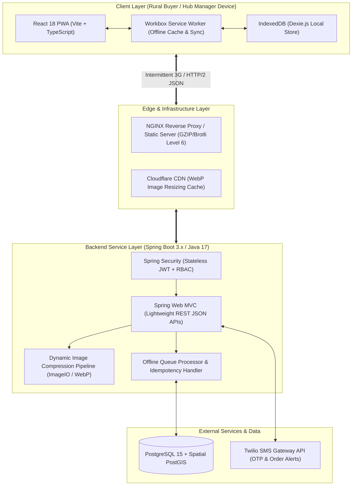
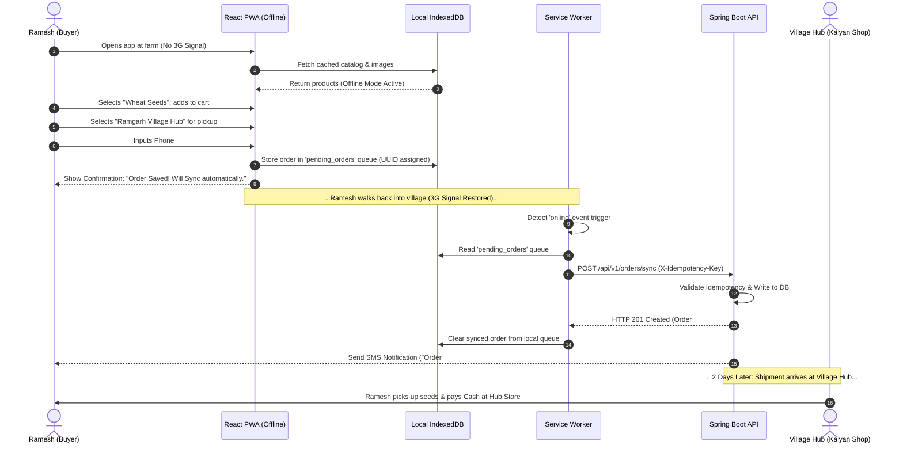
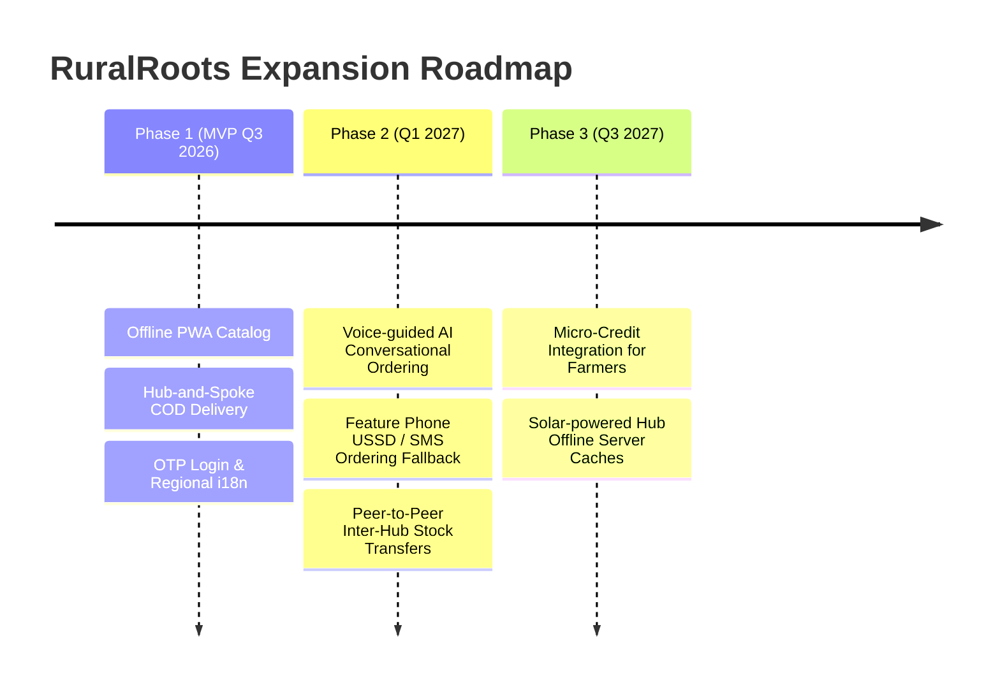

# PRODUCT REQUIREMENT DOCUMENT (PRD)

## PROJECT: RuralRoots - Rural-First E-Commerce Platform
**Architectural Stack:** Java 17+ / Spring Boot 3.x | React.js 18 (Vite PWA) | PostgreSQL 15 | Twilio SMS Gateway  
**Document Version:** 1.0.0  
**Target Release:** MVP Q3 2026  
**Author:** Senior Product Manager, Digital Inclusion & Social Impact Tech  

---

## 1. PROJECT OVERVIEW & GOALS

### 1.1 Core Problem Statement
Rural communities in developing regions face severe structural barriers when accessing digital commerce. Traditional e-commerce platforms assume continuous 4G/5G broadband, modern smartphones, high digital literacy, and mapped street addresses. In contrast, rural environments present three main bottlenecks:

1. **Weak & Intermittent Connectivity:** High latency, frequent packet loss, and frequent complete network dropouts (2G/3G networks with spotty data availability).
2. **Hardware & Resource Constraints:** Widespread reliance on low-end Android smartphones ($50–$100 devices with < 2GB RAM, slow processors, limited internal storage under 16GB, and strict mobile data budget caps).
3. **Usability & Logistics Friction:** Low text literacy, lack of familiarity with complex checkout flows, non-existent door-to-door GPS addresses, and widespread distrust of online prepayment methods.

**RuralRoots** solves these issues through a **PWA-first, Hub-and-Spoke offline-resilient architecture** that empowers rural buyers to browse, cart, and place orders without internet signal, delivering goods to local trusted community hubs for cash collection.

---

### 1.2 Target Audience Definition

| Persona Role | Target User | Key Needs & Constraints | Primary Interface |
| :--- | :--- | :--- | :--- |
| **Rural Buyer** ("Gramin Grahak") | Rural consumers, farmers, local artisans. | Needs icon-driven/low-text navigation, local language support, offline cart creation, zero prepaid requirement, local pickup point. | Mobile PWA (Low-footprint, Offline-capable) |
| **Village Hub Manager** ("Gram Kendra Adhikari") | Local Kirana shopkeeper, community leader, or rural entrepreneur. | Needs simple shipment receiving interface, cash collection tracker, buyer verification tool, offline-assisted ordering for walk-ins. | Mobile/Tablet PWA (Hub Operations Mode) |
| **Hub Delivery Agent** ("Gram Sathi") | Local village logistics runner operating within 5–10 km radius. | Needs lightweight daily drop lists, offline route checklists, SMS-triggered delivery confirmations. | Mobile PWA / SMS Gateway |

---

### 1.3 Core Success Metrics & SLA Benchmarks

```
+-----------------------------------------------------------------------------------+
|                            CORE PERFORMANCE BENCHMARKS                            |
+------------------------------------+----------------------------------------------+
| Metric                             | SLA Target Benchmark                         |
+------------------------------------+----------------------------------------------+
| 3G Initial Load Time (FCP)         | < 1.2 seconds (First Contentful Paint)       |
| 3G Time to Interactive (TTI)       | < 2.0 seconds                                |
| Total App Shell + Assets Footprint | < 3.0 MB total client-side storage           |
| JS Bundle Size (Gzipped)           | < 150 KB initial payload                     |
| Offline Order Sync Success Rate    | >= 99.5% with zero order duplication         |
| Session Data Consumption           | < 500 KB per active browsing session         |
| SMS OTP Delivery Speed             | < 3.0 seconds via Twilio API route fallback  |
+------------------------------------+----------------------------------------------+
```

---

## 2. SYSTEM ARCHITECTURE & TECH STACK

### 2.1 System Architecture Topology



---

### 2.2 Frontend Architecture (React PWA + Vite)

* **Build Tooling & Bundle Budget:** Vite 5.x configured with aggressive code-splitting. Initial entry bundle capped at **120 KB gzipped**.
* **PWA & Offline Service Worker:** Built with `Workbox 7.0` using custom caching strategies:
  * **App Shell & Fonts:** `CacheFirst` strategy with 1-year expiration (`Cache-Control: immutable`).
  * **Product Catalog & Categories:** `StaleWhileRevalidate` with background update re-render triggers.
  * **Cart & Order Placement:** Intercepted by Service Worker; persisted immediately to IndexedDB when offline.
  * **Background Sync API:** Workbox `BackgroundSyncPlugin` with tag `ruralroots-order-queue`. Automatically triggers sync retry when `navigator.onLine` fires.
* **Client-Side Storage Engine:** `Dexie.js` wrapper around IndexedDB with schema:
  * `products`: Cached product list with image URLs, localized titles, and prices.
  * `pending_orders`: Local queue for orders created offline, containing payload + `idempotency_key`.
  * `user_session`: Token, language preference, selected hub.

---

### 2.3 Backend Architecture (Spring Boot + Java 17)

* **Framework Configuration:** Spring Boot 3.2.x running on Java 17 LTS.
* **Payload Compression & HTTP Setup:**
  ```properties
  server.compression.enabled=true
  server.compression.mime-types=text/html,text/xml,text/plain,text/css,application/javascript,application/json
  server.compression.min-response-size=1024
  server.http2.enabled=true
  ```
* **Performance Tuning:** Jackson JSON serializer configured to exclude null/empty fields (`@JsonInclude(Include.NON_NULL)`). Light DTOs strip unnecessary server metadata to maintain payload size < 15 KB per REST call.
* **Image Compression Service:** On-the-fly image converter using Java `ImageIO` and WebP plugins. Resizes uploaded product images into two responsive targets:
  * Thumbnail: 150x150 px WebP (Quality 60%, ~5 KB)
  * Detail View: 600x600 px WebP (Quality 65%, ~25 KB)

---

### 2.4 Database Schema (PostgreSQL 15)

```sql
-- 1. Users Table
CREATE TABLE users (
    id BIGSERIAL PRIMARY KEY,
    phone_number VARCHAR(15) UNIQUE NOT NULL,
    full_name VARCHAR(100),
    role VARCHAR(20) NOT NULL CHECK (role IN ('ROLE_BUYER', 'ROLE_HUB_MANAGER', 'ROLE_ADMIN')),
    preferred_language VARCHAR(5) DEFAULT 'hi',
    is_active BOOLEAN DEFAULT TRUE,
    created_at TIMESTAMP WITH TIME ZONE DEFAULT CURRENT_TIMESTAMP
);

-- 2. Village Hubs Table
CREATE TABLE village_hubs (
    id BIGSERIAL PRIMARY KEY,
    hub_code VARCHAR(20) UNIQUE NOT NULL,
    hub_name VARCHAR(100) NOT NULL,
    manager_id BIGINT REFERENCES users(id),
    pincode VARCHAR(10) NOT NULL,
    village_name VARCHAR(100) NOT NULL,
    district VARCHAR(100) NOT NULL,
    state VARCHAR(100) NOT NULL,
    landmark TEXT,
    latitude NUMERIC(10,8),
    longitude NUMERIC(11,8),
    operates_cod BOOLEAN DEFAULT TRUE,
    created_at TIMESTAMP WITH TIME ZONE DEFAULT CURRENT_TIMESTAMP
);

-- 3. Products Table (JSONB for Multi-Lingual Support)
CREATE TABLE products (
    id BIGSERIAL PRIMARY KEY,
    sku VARCHAR(50) UNIQUE NOT NULL,
    title_i18n JSONB NOT NULL, -- e.g., {"en": "Wheat Seed 5kg", "hi": "गेहूं का बीज 5 किलो"}
    description_i18n JSONB NOT NULL,
    base_price NUMERIC(10,2) NOT NULL,
    stock_quantity INT NOT NULL DEFAULT 0,
    thumbnail_url VARCHAR(255) NOT NULL,
    images_json JSONB NOT NULL,
    is_active BOOLEAN DEFAULT TRUE,
    version BIGINT NOT NULL DEFAULT 0 -- Optimistic Locking
);

-- 4. Orders Table (Offline Sync & Idempotency)
CREATE TABLE orders (
    id BIGSERIAL PRIMARY KEY,
    order_number VARCHAR(30) UNIQUE NOT NULL,
    idempotency_key UUID UNIQUE NOT NULL,
    buyer_id BIGINT NOT NULL REFERENCES users(id),
    hub_id BIGINT NOT NULL REFERENCES village_hubs(id),
    order_status VARCHAR(30) NOT NULL DEFAULT 'PENDING_SYNC',
    payment_type VARCHAR(20) NOT NULL DEFAULT 'COD',
    payment_status VARCHAR(20) NOT NULL DEFAULT 'UNPAID',
    total_amount NUMERIC(10,2) NOT NULL,
    offline_created_at TIMESTAMP WITH TIME ZONE NOT NULL,
    synced_at TIMESTAMP WITH TIME ZONE DEFAULT CURRENT_TIMESTAMP
);

-- 5. Order Items Table
CREATE TABLE order_items (
    id BIGSERIAL PRIMARY KEY,
    order_id BIGINT NOT NULL REFERENCES orders(id) ON DELETE CASCADE,
    product_id BIGINT NOT NULL REFERENCES products(id),
    quantity INT NOT NULL CHECK (quantity > 0),
    unit_price NUMERIC(10,2) NOT NULL
);

-- Indexing for performance
CREATE INDEX idx_products_active ON products(is_active);
CREATE INDEX idx_orders_buyer ON orders(buyer_id);
CREATE INDEX idx_orders_hub_status ON orders(hub_id, order_status);
CREATE UNIQUE INDEX idx_orders_idempotency ON orders(idempotency_key);
```

---

### 2.5 SMS Gateway Integration (Twilio Fallback)

* **Primary Mechanism:** Transactional SMS sent via Spring Boot `WebClient` calling Twilio REST API.
* **Payload Guidelines:** Messages limited to **140 characters** in clear, localized script.

```java
// Spring Boot Service Stub for SMS Dispatch
@Service
public class SmsNotificationService {
    @Value("${twilio.account.sid}") private String accountSid;
    @Value("${twilio.auth.token}") private String authToken;
    @Value("${twilio.phone.number}") private String fromNumber;

    public void sendOrderConfirmationSms(String toPhone, String orderNum, String hubName) {
        String msg = String.format("RuralRoots: Order #%s confirmed! Pickup at %s Hub. Pay Cash on delivery.", orderNum, hubName);
        // Dispatch asynchronously via WebClient to avoid blocking API threads
        WebClient.create("https://api.twilio.com/2010-04-01/Accounts/" + accountSid + "/Messages.json")
            .post()
            .headers(headers -> headers.setBasicAuth(accountSid, authToken))
            .body(BodyInserters.fromFormData("To", toPhone)
                .with("From", fromNumber)
                .with("Body", msg))
            .retrieve()
            .bodyToMono(String.class)
            .subscribe();
    }
}
```

---

## 3. USER PERSONAS & JOURNEYS

### 3.1 Persona 1: The Rural Buyer ("Ramesh Patel")

```
+-----------------------------------------------------------------------------------+
| PERSONA: RAMESH PATEL (Rural Buyer)                                              |
+-----------------------------------------------------------------------------------+
| Demographic: 38 years old, Smallholder Farmer, Ramgarh Village                     |
| Device: $75 Android 9 Smartphone, 1.5GB RAM, 3G mobile data (Intermittent)        |
| Key Goals: Buy crop fertilizers/seeds easily, avoid long trips to city market     |
| Barriers: Low text literacy, fears money loss on credit card, zero internet at farm|
+-----------------------------------------------------------------------------------+
```

#### User Journey Flowchart



---

### 3.2 Persona 2: The Village Hub Manager ("Sunita Devi")

```
+-----------------------------------------------------------------------------------+
| PERSONA: SUNITA DEVI (Village Hub Manager)                                        |
+-----------------------------------------------------------------------------------+
| Demographic: 32 years old, Kirana Store Owner, Ramgarh Village Center             |
| Device: Mid-range Android Tablet, Stable Hub Wi-Fi/4G connection                  |
| Key Goals: Earn commission on order drops, drive foot traffic to her store        |
| Barriers: Cannot spend hours doing manual paperwork or complex computer software  |
+-----------------------------------------------------------------------------------+
```

#### Operational Workflow Steps:
1. **Hub Handover Management:** Log in via OTP -> Select "Incoming Deliveries" -> Scan/Check bulk shipment package delivered by central truck.
2. **Customer Order Handover:** Search buyer's mobile number or 4-digit pickup OTP -> Inspect items -> Click "Collect Cash & Mark Delivered" -> Hand over package to buyer.
3. **Assisted Ordering for Villagers:** Assist illiterate buyers by creating orders on their behalf using the "Hub Agent Assisted Checkout" feature.

---

## 4. FUNCTIONAL REQUIREMENTS (EPICS & USER STORIES)

### EPIC 1: PWA & Offline Resilience

#### User Story 1.1: Offline Catalog Browsing
* **As a** Rural Buyer,  
* **I want to** browse product categories, search items, and view prices without an active internet connection,  
* **So that** I can make purchasing decisions anywhere, regardless of network dropouts.

##### Acceptance Criteria:
* **AC 1.1.1:** Upon initial launch with connectivity, the Service Worker pre-caches top 50 high-demand product records and category manifests into IndexedDB.
* **AC 1.1.2:** If `navigator.onLine === false`, the PWA UI displays a subtle visual status bar: *"Offline Mode - Displaying Cached Catalog"*.
* **AC 1.1.3:** All images load using low-resolution WebP thumbnails stored in CacheStorage. If an image is uncached, a light SVG placeholder icon (1 KB) renders inline without breaking UI layout.

---

#### User Story 1.2: Background Synchronization Queue
* **As a** Rural Buyer,  
* **I want to** place an order while offline and have it automatically submitted when connectivity returns,  
* **So that** I don't lose my cart or have to re-enter details when signal fluctuates.

##### Acceptance Criteria:
* **AC 1.2.1:** Clicking "Place Order" offline stores the payload in IndexedDB `pending_orders` with a generated UUID `idempotency_key`.
* **AC 1.2.2:** PWA registers a Workbox BackgroundSync tag (`ruralroots-order-sync`).
* **AC 1.2.3:** When network connection is re-established, the SW sends `POST /api/v1/orders/sync` payload.
* **AC 1.2.4:** On HTTP 201 response, the local queue item is removed, and the user receives a native UI Toast notification and SMS confirmation.

---

### EPIC 2: Simplified Onboarding & Multi-Lingual Interface

#### User Story 2.1: Passwordless OTP Phone Login
* **As a** Rural Buyer,  
* **I want to** log in using only my 10-digit phone number and a 4-digit SMS OTP,  
* **So that** I don't need to create or remember passwords or email accounts.

##### Acceptance Criteria:
* **AC 2.1.1:** Login screen features an auto-focused numeric keypad input (`<input type="tel" pattern="[0-9]{10}">`).
* **AC 2.1.2:** Backend endpoint `POST /api/v1/auth/request-otp` generates a 4-digit cryptographically random OTP with 5-minute expiry. Rate-limited to 3 requests/hour per phone number.
* **AC 2.1.3:** PWA utilizes the WebOTP API to automatically read incoming SMS and auto-fill the 4-digit code.
* **AC 2.1.4:** Successful authentication returns a lightweight JWT token stored securely in client IndexedDB, keeping the session active for 30 days.

---

#### User Story 2.2: Low-Text, Multi-Lingual & Voice-Assisted Interface
* **As a** Semi-Literate Rural Buyer,  
* **I want to** switch the app to my local language and use visual/audio prompts,  
* **So that** I can comfortably navigate and order products without reading complex text.

##### Acceptance Criteria:
* **AC 2.2.1:** Header includes a prominent visual Language Switcher (English, Hindi, Marathi, Gujarati). Language state updates instantly client-side without full page reload.
* **AC 2.2.2:** API returns product DTO with `title_i18n` JSON payload. Client renders title matching active user locale, defaulting to English if translation key is absent.
* **AC 2.2.3:** Search bar contains a Microphone icon utilizing the Web Speech API (`webkitSpeechRecognition`). Spoken local language input auto- populates text search query.

---

### EPIC 3: Hub-and-Spoke Order Placement & Cash Logistics

#### User Story 3.1: Village Hub Selection at Checkout
* **As a** Rural Buyer,  
* **I want to** select a nearby Village Hub store as my delivery location,  
* **So that** I can pick up my items from a trusted local spot without needing a pin-point street address.

##### Acceptance Criteria:
* **AC 3.1.1:** Checkout address step displays a simple dropdown/list of Village Hubs filtered by user's District or Pincode.
* **AC 3.1.2:** Each Hub option displays: Store Name, Manager Name, Landmark, and Distance.
* **AC 3.1.3:** Selected `hub_id` is recorded as the target fulfillment point on the order record.

---

#### User Story 3.2: Hub Cash-on-Delivery (COD) & Handover Workflow
* **As a** Village Hub Manager,  
* **I want to** mark cash received and confirm item handover to buyers,  
* **So that** financial reconciliation and order delivery status are updated in real-time.

##### Acceptance Criteria:
* **AC 3.2.1:** Hub Manager accesses `/hub/handover` dashboard.
* **AC 3.2.2:** Manager enters buyer's phone number or 4-digit pickup code to retrieve pending pickup orders.
* **AC 3.2.3:** Manager clicks "Collect ₹[Amount] Cash & Complete Delivery".
* **AC 3.2.4:** Spring Boot backend updates order status to `DELIVERED`, records entry in `hub_cash_ledger`, and dispatches delivery confirmation SMS to buyer.

---

## 5. NON-FUNCTIONAL REQUIREMENTS (NFRs)

### 5.1 Performance & Resource Limits

```
+-----------------------------------------------------------------------------------+
|                        RESOURCE & PERFORMANCE CONSTRAINTS                         |
+------------------------------------+----------------------------------------------+
| Parameter                          | SLA / Maximum Constraint Limit               |
+------------------------------------+----------------------------------------------+
| Gzipped JS Bundle Size             | Max 150 KB (Initial bundle)                  |
| CSS Bundle Size                    | Max 30 KB (Vanilla CSS / Modules)            |
| Single Product WebP Image (Thumb)  | Max 8 KB (150x150 px)                        |
| Single Product WebP Image (Detail) | Max 30 KB (600x600 px)                       |
| REST API Payload Size              | Max 15 KB per response                       |
| Database Connection Pool           | HikariCP max-pool-size: 20, min-idle: 5      |
| Server Response Latency (TTFB)     | < 200 ms for core REST API routes            |
+------------------------------------+----------------------------------------------+
```

---

### 5.2 Security Architecture & Role-Based Access Control (RBAC)

* **Authentication Protocol:** Stateless JWT (JSON Web Token) with HMAC-SHA256 signature. Token lifetime: 30 days.
* **Role Permissions Matrix:**

| Role | Endpoint Patterns | Permitted Actions |
| :--- | :--- | :--- |
| `ROLE_BUYER` | `/api/v1/buyer/**`, `/api/v1/orders/sync`, `/api/v1/products/**` | Browse catalog, create offline orders, view personal order history. |
| `ROLE_HUB_MANAGER` | `/api/v1/hub/**` | Inspect incoming shipments, process customer cash handovers, view hub cash ledger. |
| `ROLE_ADMIN` | `/api/v1/admin/**` | Full CRUD on products/categories, onboard Village Hubs, system analytics. |

```java
// Spring Security Configuration Snippet
@Configuration
@EnableWebSecurity
public class SecurityConfig {

    @Bean
    public SecurityFilterChain filterChain(HttpSecurity http) throws Exception {
        http
            .csrf(csrf -> csrf.disable())
            .sessionManagement(sm -> sm.sessionCreationPolicy(SessionCreationPolicy.STATELESS))
            .authorizeHttpRequests(auth -> auth
                .requestMatchers("/api/v1/auth/**", "/api/v1/products/**", "/api/v1/categories/**").permitAll()
                .requestMatchers("/api/v1/buyer/**", "/api/v1/orders/sync").hasRole("BUYER")
                .requestMatchers("/api/v1/hub/**").hasRole("HUB_MANAGER")
                .requestMatchers("/api/v1/admin/**").hasRole("ADMIN")
                .anyRequest().authenticated()
            )
            .addFilterBefore(jwtAuthenticationFilter(), UsernamePasswordAuthenticationFilter.class);
        return http.build();
    }
}
```

---

### 5.3 Reliability, Transaction Safety & Idempotency

#### Server-Side Order Sync Idempotency Logic
To ensure zero duplicate orders during background synchronization over unstable 3G networks:

```java
@Service
@Transactional
public class OrderSyncService {

    @Autowired private OrderRepository orderRepository;
    @Autowired private ProductRepository productRepository;

    public OrderResponseDTO processSyncedOrder(OrderSyncRequestDTO dto, Long buyerId) {
        // 1. Check for duplicate submission using Idempotency Key
        Optional<Order> existingOrder = orderRepository.findByIdempotencyKey(dto.getIdempotencyKey());
        if (existingOrder.isPresent()) {
            return OrderMapper.toDto(existingOrder.get()); // Return existing record safely
        }

        // 2. Build & Validate New Order
        Order order = new Order();
        order.setIdempotencyKey(dto.getIdempotencyKey());
        order.setBuyerId(buyerId);
        order.setHubId(dto.getHubId());
        order.setOrderStatus("CONFIRMED");
        order.setPaymentType(dto.getPaymentType());
        order.setOfflineCreatedAt(dto.getOfflineCreatedAt());

        // 3. Deduct Stock with Optimistic Locking
        for (OrderItemDTO itemDto : dto.getItems()) {
            Product product = productRepository.findById(itemDto.getProductId())
                .orElseThrow(() -> new ResourceNotFoundException("Product not found"));
            
            if (product.getStockQuantity() < itemDto.getQuantity()) {
                throw new InsufficientStockException("Stock depleted for item: " + product.getId());
            }
            product.setStockQuantity(product.getStockQuantity() - itemDto.getQuantity());
            productRepository.save(product); // @Version triggers concurrency check
        }

        Order savedOrder = orderRepository.save(order);
        return OrderMapper.toDto(savedOrder);
    }
}
```

---

## 6. LOGISTICS & OUT-OF-SCOPE FOR MVP

### 6.1 Explicitly Out-of-Scope (MVP Exclusions)

To maintain focus on core rural accessibility and performance constraints, the following features are **explicitly excluded** from the MVP:

1. **GPS Door-to-Door Navigation:** No live map tracking or exact house location pinning (Delivery terminates at Village Hub).
2. **Online Credit / Debit Card Gateways:** Excluded due to low rural penetration and high drop-off rates. Payment is strictly COD at Hub or UPI at Hub.
3. **Real-Time Dynamic Driver Tracking:** No uber-style live vehicle map tracking for end buyers.
4. **Automated Return & Refund Portals:** Returns are handled in-person via Hub Manager inspection and manual credit logging.
5. **Multi-Vendor Marketplace Dashboard:** Product creation and inventory management are controlled centrally by platform admins for MVP.

---

### 6.2 Post-MVP Roadmap & Future Phases



---
*End of Document. Approved for Full-Stack Development Execution.*
